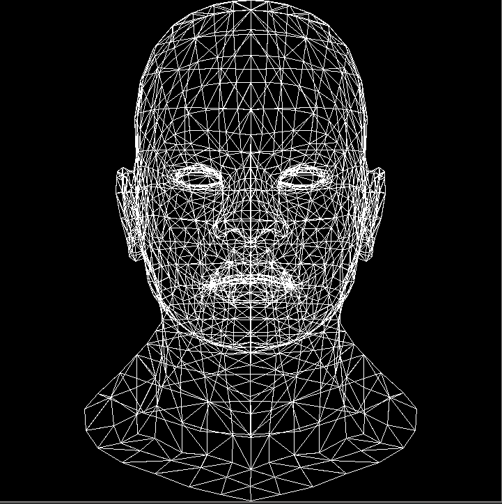

# Software rasteriser written in C
...that made me realise programming in C++ isn't so bad after all

## Screenshots

## Resources
[Beej's guide to C programming](https://beej.us/guide/bgc/html/split/)

[tinyrenderer](https://github.com/ssloy/tinyrenderer/wiki)
